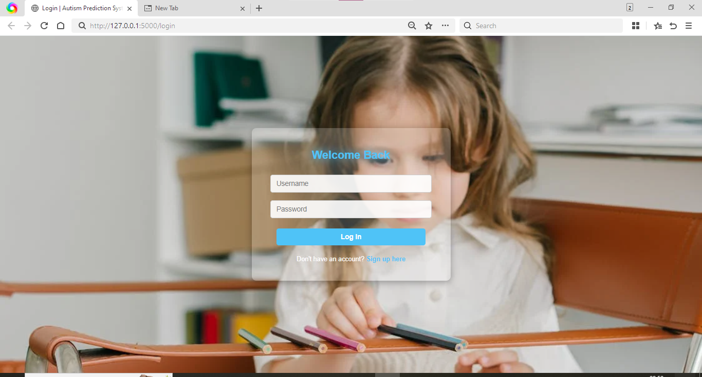
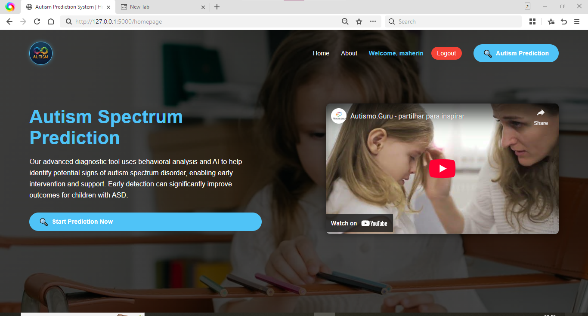
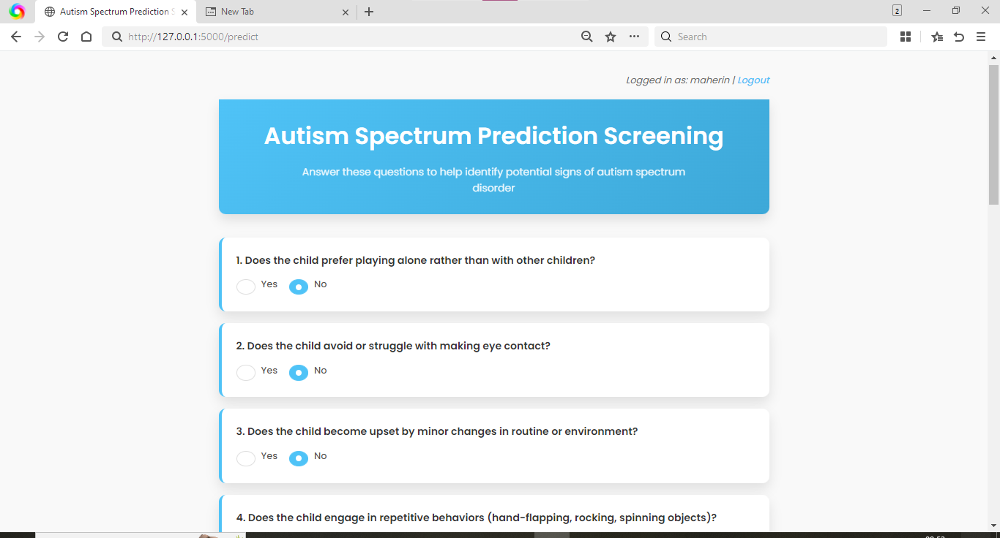
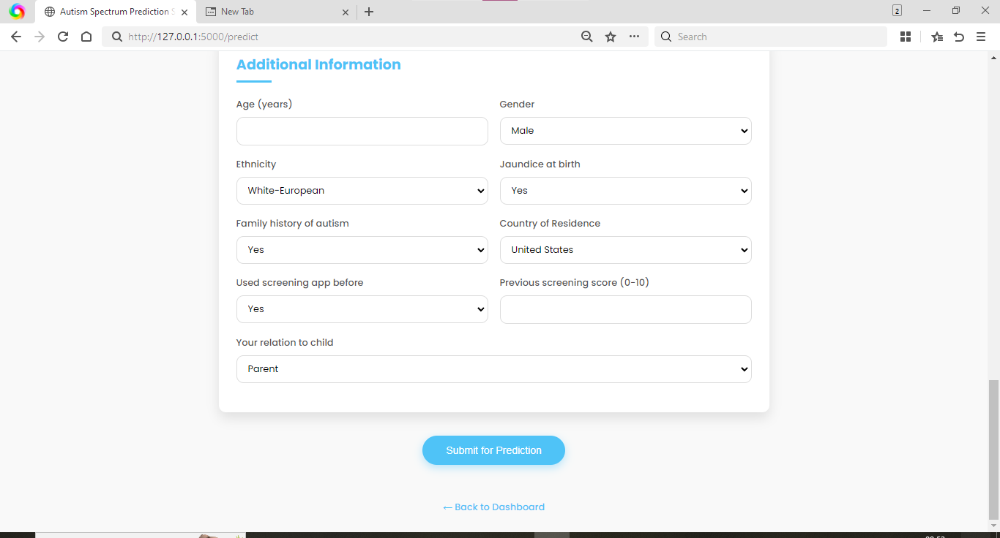
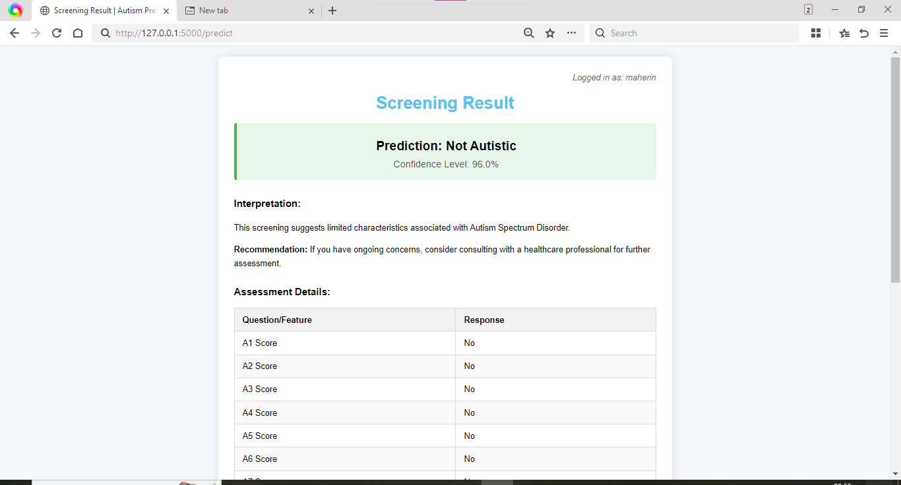
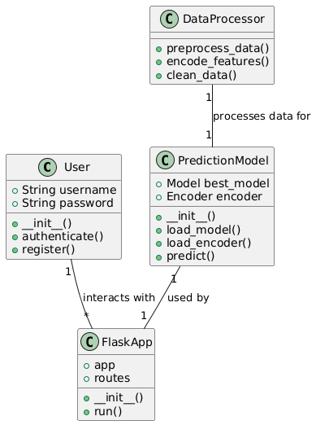
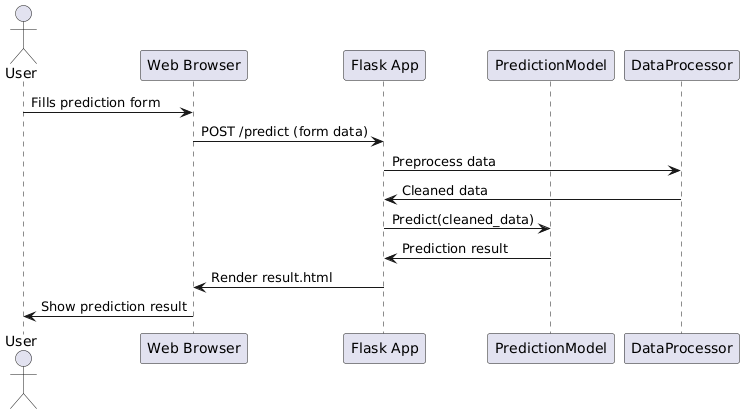
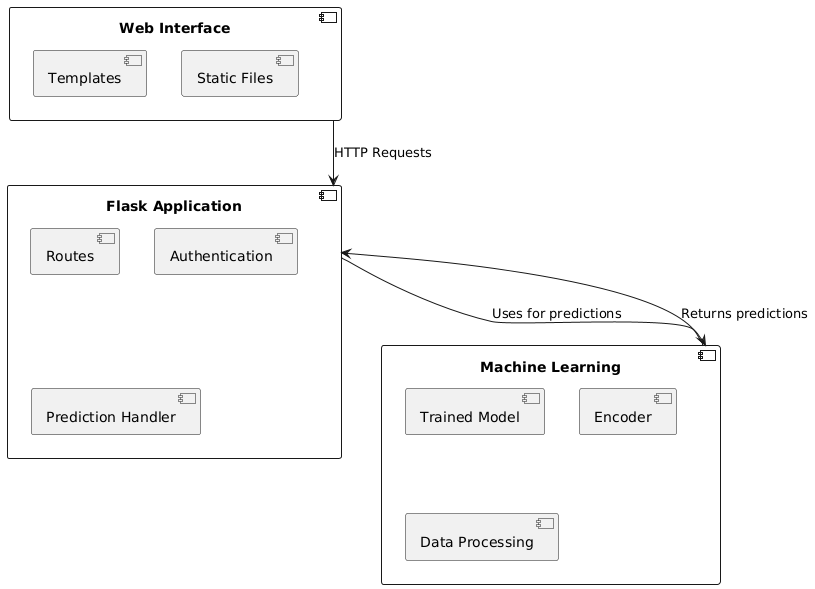

# 🧠 Autism Prediction System using Machine Learning

This is a Flask-based machine learning web application that predicts the likelihood of Autism Spectrum Disorder (ASD) in individuals based on questionnaire inputs and behavioral attributes. The best-performing model is deployed for real-time prediction.

## 📌 Table of Contents

- [About the Project](#about-the-project)
- [Tech Stack](#tech-stack)
- [Features](#features)
- [Machine Learning Models Used](#machine-learning-models-used)
- [Project Structure](#project-structure)
- [How to Run Locally](#how-to-run-locally)
- [Screenshots & UML Diagrams](#screenshots--uml-diagrams)
- [Team](#team)
- [License](#license)

---

## 📖 About the Project

This project aims to help in the early detection of Autism Spectrum Disorder using machine learning. It provides a user-friendly web interface for submitting questionnaire data and instantly receives predictive results based on a trained classifier.

The dataset was collected from Kaggle and cleaned using preprocessing techniques. The final model was selected using RandomizedSearchCV with performance metrics such as Accuracy, Precision, Recall, and F1 Score.

---

## 🧰 Tech Stack

- **Python 3**
- **Flask** – Web framework
- **scikit-learn** – ML modeling and preprocessing
- **XGBoost** – Gradient boosting classifier
- **Pandas & NumPy** – Data manipulation
- **SMOTE** – Handling class imbalance
- **HTML/CSS** – Frontend design
- **GitHub Desktop** – Version control

---

## 🌟 Features

- Interactive web interface using Flask
- Data preprocessing with encoding, scaling, and SMOTE
- Model training with Decision Tree, Random Forest, and XGBoost
- Hyperparameter tuning using RandomizedSearchCV
- Real-time autism prediction based on user input
- UML diagrams included for software documentation

---

## 📊 Machine Learning Models Used

- **Decision Tree Classifier**
- **Random Forest Classifier** (Selected as best)
- **XGBoost Classifier**

Each model was evaluated using Accuracy, Precision, Recall, and F1 Score. The Random Forest model gave the best balance of performance.

---

## 📁 Project Structure

📦 autism-prediction-system ├── app.py ├── templates/ │ ├── home.html │ ├── prediction.html │ └── result.html ├── models/ │ ├── best_model.pkl │ └── encoder.pkl ├── static/ │ └── (if any images or CSS used) ├── diagrams/ │ ├── class.png │ ├── sequence.png │ ├── structure.png │ ├── component.png │ └── deployment.png ├── requirements.txt └── README.md


---

## 💻 How to Run Locally

```bash
git clone https://github.com/Maherin-shaik/autism-prediction-system.git
cd autism-prediction-system
pip install -r requirements.txt
python app.py


Then open http://127.0.0.1:5000/ in your browser to use the app.

## 📷 Screenshots & UML Diagrams
🎨 UI Screens

### Lohin Page


### 🏠 Home Page


### 📝 Prediction Form



### 📊 Result Page



## 📊 UML Diagrams

### Class Diagram


### Sequence Diagram


### Component Diagram


### Deployment Diagram


### Structure


👨‍💻 Team
Team Lead: Shaik Maherin

Member 1: B Devi

Member 2: B Srilatha

Member 3: B Priyanka

📄 License
This project is for academic and learning purposes only.
